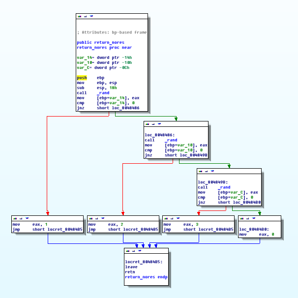
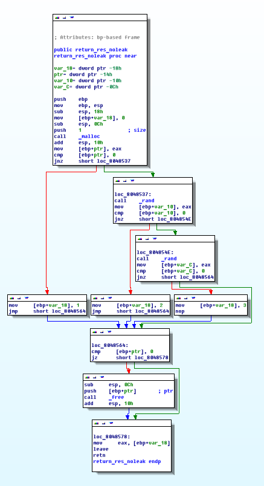
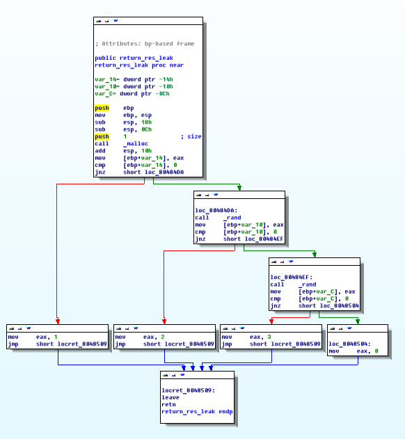
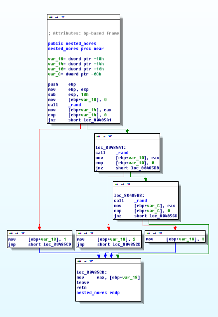
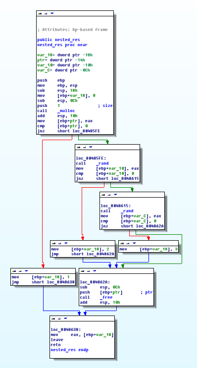
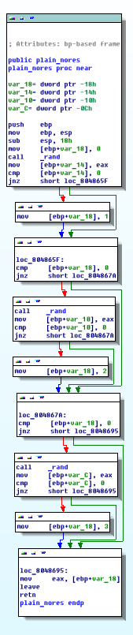
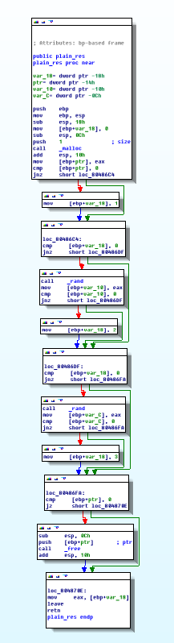

# GoTo or not GoTo

## Задача
Выяснить наилучший способ обработки ошибок в программах на Си.

### Return без ресурсов
```c
int return_nores (void)
{
    int foo = rand();
    if (foo == 0)
        return EFOO;

    int bar = rand();
    if (bar == 0)
        return EBAR;

    int baz = rand();
    if (baz == 0)
        return EBAZ;

    return EOK;
}
```
```asm
0804846b <return_nores>:
 804846b:	push   ebp
 804846c:	mov    ebp,esp
 804846e:	sub    esp,0x18
 8048471:	call   8048350 <rand@plt>          ; call rand()
 8048476:	mov    DWORD PTR [ebp-0x14],eax    ; foo = rand();
 8048479:	cmp    DWORD PTR [ebp-0x14],0x0
 804847d:	jne    8048486 <return_nores+0x1b> ; if (foo != 0)
 804847f:	mov    eax,0x1                     ; set return value EFOO (1)
 8048484:	jmp    80484b5 <return_nores+0x4a> ; return val;
 8048486:	call   8048350 <rand@plt>
 804848b:	mov    DWORD PTR [ebp-0x10],eax
 804848e:	cmp    DWORD PTR [ebp-0x10],0x0
 8048492:	jne    804849b <return_nores+0x30>
 8048494:	mov    eax,0x2
 8048499:	jmp    80484b5 <return_nores+0x4a>
 804849b:	call   8048350 <rand@plt>
 80484a0:	mov    DWORD PTR [ebp-0xc],eax
 80484a3:	cmp    DWORD PTR [ebp-0xc],0x0
 80484a7:	jne    80484b0 <return_nores+0x45>
 80484a9:	mov    eax,0x3
 80484ae:	jmp    80484b5 <return_nores+0x4a>
 80484b0:	mov    eax,0x0
 80484b5:	leave  
 80484b6:	ret    
```


Как видно из графа, лишних сравнений производиться не будет.

### Return с ресурсами (правильный вариант)
```asm
0804850b <return_res_noleak>:
 804850b:	push   ebp
 804850c:	mov    ebp,esp
 804850e:	sub    esp,0x18
 8048511:	mov    DWORD PTR [ebp-0x18],0x0
 8048518:	sub    esp,0xc
 804851b:	push   0x1
 804851d:	call   8048330 <malloc@plt>
 8048522:	add    esp,0x10
 8048525:	mov    DWORD PTR [ebp-0x14],eax          ; foo_p = malloc(...);
 8048528:	cmp    DWORD PTR [ebp-0x14],0x0
 804852c:	jne    8048537 <return_res_noleak+0x2c>
 804852e:	mov    DWORD PTR [ebp-0x18],0x1          ; err = 1;
 8048535:	jmp    8048564 <return_res_noleak+0x59>  ; goto failure;
 8048537:	call   8048350 <rand@plt>
 804853c:	mov    DWORD PTR [ebp-0x10],eax
 804853f:	cmp    DWORD PTR [ebp-0x10],0x0
 8048543:	jne    804854e <return_res_noleak+0x43>
 8048545:	mov    DWORD PTR [ebp-0x18],0x2
 804854c:	jmp    8048564 <return_res_noleak+0x59>
 804854e:	call   8048350 <rand@plt>
 8048553:	mov    DWORD PTR [ebp-0xc],eax
 8048556:	cmp    DWORD PTR [ebp-0xc],0x0
 804855a:	jne    8048564 <return_res_noleak+0x59>
 804855c:	mov    DWORD PTR [ebp-0x18],0x3
 8048563:	nop
 8048564:	cmp    DWORD PTR [ebp-0x14],0x0         ; failure:
 8048568:	je     8048578 <return_res_noleak+0x6d> ; if (foo_p != 0)
 804856a:	sub    esp,0xc
 804856d:	push   DWORD PTR [ebp-0x14]
 8048570:	call   8048320 <free@plt>
 8048575:	add    esp,0x10
 8048578:	mov    eax,DWORD PTR [ebp-0x18]
 804857b:	leave  
 804857c:	ret    
```


По сравнению с предыдущим вариантом добавляется дополнительное условие (8048568) проверки
указателя. В случае инициализации ресурса не в начале, данная проверка будет избыточной
для случаев выхода из функии до инициализации ресурса, однако позволяет избежать
ошибки работы с ресурсами.

### Return с ресурсами (вариант с утечкой)
```asm
0804850b <return_res_noleak>:
 804850b:	push   ebp
 804850c:	mov    ebp,esp
 804850e:	sub    esp,0x18
 8048511:	mov    DWORD PTR [ebp-0x18],0x0
 8048518:	sub    esp,0xc
 804851b:	push   0x1
 804851d:	call   8048330 <malloc@plt>
 8048522:	add    esp,0x10
 8048525:	mov    DWORD PTR [ebp-0x14],eax
 8048528:	cmp    DWORD PTR [ebp-0x14],0x0
 804852c:	jne    8048537 <return_res_noleak+0x2c>
 804852e:	mov    DWORD PTR [ebp-0x18],0x1
 8048535:	jmp    8048564 <return_res_noleak+0x59>
 8048537:	call   8048350 <rand@plt>
 804853c:	mov    DWORD PTR [ebp-0x10],eax
 804853f:	cmp    DWORD PTR [ebp-0x10],0x0
 8048543:	jne    804854e <return_res_noleak+0x43>
 8048545:	mov    DWORD PTR [ebp-0x18],0x2
 804854c:	jmp    8048564 <return_res_noleak+0x59>
 804854e:	call   8048350 <rand@plt>
 8048553:	mov    DWORD PTR [ebp-0xc],eax
 8048556:	cmp    DWORD PTR [ebp-0xc],0x0
 804855a:	jne    8048564 <return_res_noleak+0x59>
 804855c:	mov    DWORD PTR [ebp-0x18],0x3
 8048563:	nop
 8048564:	cmp    DWORD PTR [ebp-0x14],0x0
 8048568:	je     8048578 <return_res_noleak+0x6d>
 804856a:	sub    esp,0xc
 804856d:	push   DWORD PTR [ebp-0x14]
 8048570:	call   8048320 <free@plt>
 8048575:	add    esp,0x10
 8048578:	mov    eax,DWORD PTR [ebp-0x18]
 804857b:	leave  
 804857c:	ret    
```


Данный вариант не отличается от первого, однако является неправильным, так как неправильно
завершает работу с ресурсами (не очищает память).

### Вложенные if без ресурсов
```asm
0804857d <nested_nores>:
 804857d:	push   ebp
 804857e:	mov    ebp,esp
 8048580:	sub    esp,0x18
 8048583:	mov    DWORD PTR [ebp-0x18],0x0
 804858a:	call   8048350 <rand@plt>
 804858f:	mov    DWORD PTR [ebp-0x14],eax
 8048592:	cmp    DWORD PTR [ebp-0x14],0x0
 8048596:	jne    80485a1 <nested_nores+0x24>
 8048598:	mov    DWORD PTR [ebp-0x18],0x1    ; err = 1;
 804859f:	jmp    80485cd <nested_nores+0x50> ; jump to return mov
 80485a1:	call   8048350 <rand@plt>
 80485a6:	mov    DWORD PTR [ebp-0x10],eax
 80485a9:	cmp    DWORD PTR [ebp-0x10],0x0
 80485ad:	jne    80485b8 <nested_nores+0x3b>
 80485af:	mov    DWORD PTR [ebp-0x18],0x2
 80485b6:	jmp    80485cd <nested_nores+0x50>
 80485b8:	call   8048350 <rand@plt>
 80485bd:	mov    DWORD PTR [ebp-0xc],eax
 80485c0:	cmp    DWORD PTR [ebp-0xc],0x0
 80485c4:	jne    80485cd <nested_nores+0x50>
 80485c6:	mov    DWORD PTR [ebp-0x18],0x3
 80485cd:	mov    eax,DWORD PTR [ebp-0x18]    ; set return value as err
 80485d0:	leave  
 80485d1:	ret    
```


Вложенные условные операторы без работы с ресурсами транслируются в тот же код, что и в первом примере с точностью до 2 `mov`ов (переменная err). Однако, несмотря на практически идентичный
ассемблерный код, получающийся при данных подходах, данный метод съедает намного больше
рабочего пространства экрана (особенно при большом количестве операций сравнения), хотя и
сохраняет структурность программы.

### Вложенные if с ресурсами
```asm
080485d2 <nested_res>:
 80485d2:	push   ebp
 80485d3:	mov    ebp,esp
 80485d5:	sub    esp,0x18
 80485d8:	mov    DWORD PTR [ebp-0x18],0x0
 80485df:	sub    esp,0xc
 80485e2:	push   0x1
 80485e4:	call   8048330 <malloc@plt>
 80485e9:	add    esp,0x10
 80485ec:	mov    DWORD PTR [ebp-0x14],eax
 80485ef:	cmp    DWORD PTR [ebp-0x14],0x0
 80485f3:	jne    80485fe <nested_res+0x2c>
 80485f5:	mov    DWORD PTR [ebp-0x18],0x1
 80485fc:	jmp    8048638 <nested_res+0x66>
 80485fe:	call   8048350 <rand@plt>
 8048603:	mov    DWORD PTR [ebp-0x10],eax
 8048606:	cmp    DWORD PTR [ebp-0x10],0x0
 804860a:	jne    8048615 <nested_res+0x43>
 804860c:	mov    DWORD PTR [ebp-0x18],0x2
 8048613:	jmp    804862a <nested_res+0x58>
 8048615:	call   8048350 <rand@plt>
 804861a:	mov    DWORD PTR [ebp-0xc],eax
 804861d:	cmp    DWORD PTR [ebp-0xc],0x0
 8048621:	jne    804862a <nested_res+0x58>
 8048623:	mov    DWORD PTR [ebp-0x18],0x3
 804862a:	sub    esp,0xc
 804862d:	push   DWORD PTR [ebp-0x14]
 8048630:	call   8048320 <free@plt>
 8048635:	add    esp,0x10
 8048638:	mov    eax,DWORD PTR [ebp-0x18]
 804863b:	leave  
 804863c:	ret    
```


В этом случае исключаются лишние манипуляции с ресурсами, которые не были затронуты при работе,
однако сохраняется проблема читаемости кода, особенно при большом количестве проверок.

### Последовательность if без ресурсов
```asm
0804863d <plain_nores>:
 804863d:	push   ebp
 804863e:	mov    ebp,esp
 8048640:	sub    esp,0x18
 8048643:	mov    DWORD PTR [ebp-0x18],0x0
 804864a:	call   8048350 <rand@plt>
 804864f:	mov    DWORD PTR [ebp-0x14],eax
 8048652:	cmp    DWORD PTR [ebp-0x14],0x0
 8048656:	jne    804865f <plain_nores+0x22>
 8048658:	mov    DWORD PTR [ebp-0x18],0x1
 804865f:	cmp    DWORD PTR [ebp-0x18],0x0
 8048663:	jne    804867a <plain_nores+0x3d>
 8048665:	call   8048350 <rand@plt>
 804866a:	mov    DWORD PTR [ebp-0x10],eax
 804866d:	cmp    DWORD PTR [ebp-0x10],0x0
 8048671:	jne    804867a <plain_nores+0x3d>
 8048673:	mov    DWORD PTR [ebp-0x18],0x2
 804867a:	cmp    DWORD PTR [ebp-0x18],0x0
 804867e:	jne    8048695 <plain_nores+0x58>
 8048680:	call   8048350 <rand@plt>
 8048685:	mov    DWORD PTR [ebp-0xc],eax
 8048688:	cmp    DWORD PTR [ebp-0xc],0x0
 804868c:	jne    8048695 <plain_nores+0x58>
 804868e:	mov    DWORD PTR [ebp-0x18],0x3
 8048695:	mov    eax,DWORD PTR [ebp-0x18]
 8048698:	leave  
 8048699:	ret    
```


При ошибке в работе программы в самом начале, будут произведены все последующие проверки на
наличие ошибки, что имеет смысл только в криптографических алгоритмах для избежания атак по времени.

### Последовательность if с ресурсами
```asm
0804869a <plain_res>:
 804869a:	push   ebp
 804869b:	mov    ebp,esp
 804869d:	sub    esp,0x18
 80486a0:	mov    DWORD PTR [ebp-0x18],0x0
 80486a7:	sub    esp,0xc
 80486aa:	push   0x1
 80486ac:	call   8048330 <malloc@plt>
 80486b1:	add    esp,0x10
 80486b4:	mov    DWORD PTR [ebp-0x14],eax
 80486b7:	cmp    DWORD PTR [ebp-0x14],0x0
 80486bb:	jne    80486c4 <plain_res+0x2a>
 80486bd:	mov    DWORD PTR [ebp-0x18],0x1
 80486c4:	cmp    DWORD PTR [ebp-0x18],0x0
 80486c8:	jne    80486df <plain_res+0x45>
 80486ca:	call   8048350 <rand@plt>
 80486cf:	mov    DWORD PTR [ebp-0x10],eax
 80486d2:	cmp    DWORD PTR [ebp-0x10],0x0
 80486d6:	jne    80486df <plain_res+0x45>
 80486d8:	mov    DWORD PTR [ebp-0x18],0x2
 80486df:	cmp    DWORD PTR [ebp-0x18],0x0
 80486e3:	jne    80486fa <plain_res+0x60>
 80486e5:	call   8048350 <rand@plt>
 80486ea:	mov    DWORD PTR [ebp-0xc],eax
 80486ed:	cmp    DWORD PTR [ebp-0xc],0x0
 80486f1:	jne    80486fa <plain_res+0x60>
 80486f3:	mov    DWORD PTR [ebp-0x18],0x3
 80486fa:	cmp    DWORD PTR [ebp-0x14],0x0
 80486fe:	je     804870e <plain_res+0x74>
 8048700:	sub    esp,0xc
 8048703:	push   DWORD PTR [ebp-0x14]
 8048706:	call   8048320 <free@plt>
 804870b:	add    esp,0x10
 804870e:	mov    eax,DWORD PTR [ebp-0x18]
 8048711:	leave  
 8048712:	ret    
```


Кардинальных отличий от предыдущего варианта не имеет.

## Примеры
* [redis/config.c#L208](https://github.com/antirez/redis/blob/unstable/src/config.c#L208)
* [redis/geo.c#L113](https://github.com/antirez/redis/blob/unstable/src/geo.c#L113)

## Выводы
* При отсутствии работы с ресурсами возможно непосредственное возвращение
кода ошибки
* При работе с ресурсами необходимо использовать единую точку выхода, где
приводить все ресурсы к конечному состоянию
* При малом количестве операций проверок (<3) целесообразно
использовать вложенные if
* При большом количестве операций проверок и работе с ресурсами целесообразно
использовать безусловный переход

## Литература
* [Хабр: Запретный плод GOTO сладок!](https://habrahabr.ru/post/114211/)
